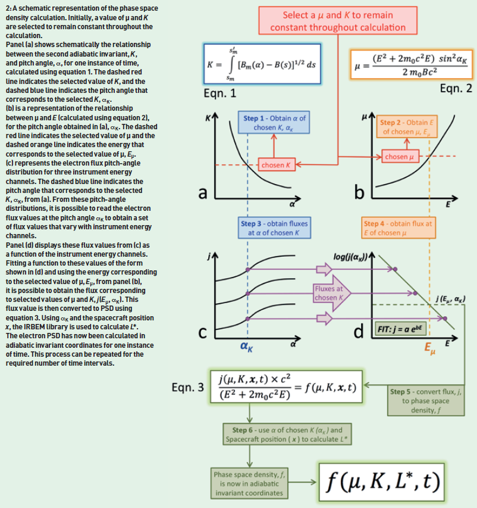
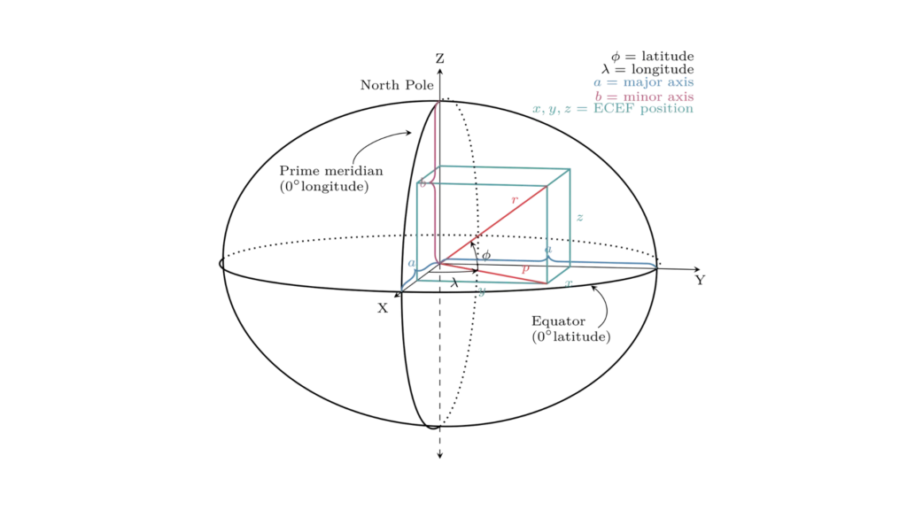

# CONVERÇÃO DE FLUXO DE ELÉTRONS DO CINTURÃO DE RADIAÇÃO INTERNO EM PHASE-SPACE DENSITY (PSD)  

## 1. Introdução

O cinturão de radiação interno é uma região do espaço entre, aproximadamente, 1.5 a 3.5 raios terrestres em que há o aprisionamento de partículas positivamente carregada às linhas de campo geomagnético.

O Phase-Space Density (PSD), $\mathbf{f}(\mu, K, L^*)$, é uma quantidade fundamental e conservada no sistema de coordenadas geomagnéticas que leva em conta as flutuações do campo. A conservação do PSD é uma premissa chave para estudar a dinâmica e o transporte das partículas no cinturão de radiação. 

O PSD é definido pelos três invariantes adiabáticos de movimento, que são as quantidades que se mantêm aproximadamente constantes ao longo da trajetória da partícula:

- Primeiro Invariante ($\mu$): Relacionado ao movimento de gyration (órbita) da partícula em torno da linha de campo.
- Segundo Invariante ($K$): Relacionado ao movimento de bounce da partícula entre os pontos de espelho nos polos. 
- Terceiro Invariante ($L_*$): Relacionado ao movimento de drift (deriva) da partícula em torno da Terra.

---
## 2. Objetivos

O objetivo principal desse projeto é transformar o fluxo de partículas no cinturão de radiação em Phase-Space Density (PSD).

---
## 3. Requisitos 
Para configurar e executar o script de rastreamento e cálculo do Phase-Space Density (PSD), são necessários os seguintes requisitos:

### 3.1 Requisitos de Software

-   **Versão do Python:** Requer Python 3.x (Desenvolvido e testado na versão **3.13.5**).

### 3.2 Dependências de Bibliotecas (Python Packages)

As seguintes bibliotecas são essenciais e devem ser instaladas (recomenda-se o uso de ambientes virtuais e `pip`):

-   **`numpy`**: Para operações matemáticas de vetores e arrays, e manipulação eficiente de dados numéricos.
-   **`pandas`**: Para processamento e manipulação de dados.
-   **`scipy`**: Para integração numérica e interpolação.
-   **`matplotlib`**: Para visualização 3D das linhas de campo e plotagem de curvas.
-   **`spacepy`**: para manipulação de tempo (`spt.Ticktock`), conversão de coordenadas (`spc.Coords`), e acesso ao modelo de campo magnético (`irbempy`).
-   **`ppigrf`**: Específico para cálculo do campo geomagnético IGRF/DGRF.

---
## 4. Estrutura do Repositório

A estrutura de arquivos do projeto está organizada para separar os scripts principais, os módulos funcionais, e os diretórios de saída/recursos.

| Módulo/Diretório | Descrição |
| :---: | :---: |
| assets/ | Diretório para imagens e figuras de referência (e.g., Figura 2a do artigo). |
| results/ | Diretório de saída para logs e dados consolidados. |
| def_b_igrf.py | Cálculo do campo Magnético IGRF. |
| def_ceg_to_ecef.py | Conversão de Coordenadas Esféricas Geocêntricas (CEG) para ECEF. |
| def_field_line_igrf_deriv.py | Função de Derivada B/|B| para o Runge-Kutta. |
| def_integrand_k_igrf.py | Função integrando (f(s) = sqrt(Bm - B(s))) para a quadratura K. |
| def_mirror_point_event_igrf.py | Função de evento de parada (Bm - B(s) = 0) para o rastreamento. |
| def_plot_cge.py | Plotagem esquemática 3D da localização inicial. |
| plot_3D_field_line.py | Plotagem 3D da linha de campo rastreamento. |
| step_1_igrf.py | Script principal da etapa 1 (Main Loop, Orchestration da Etapa 1 do projeto). |
  
---
## 5. Metodologia
Para realizar esse trabalho utilizou-se a sequência sugerida pelo artigo [1]. Esse artigo propõe 6 etapas para fazer a conversão, que são, respectivamente: 

1) Calcular o pitch angle para o $K$ escolhido;
2) Calcular a energia para o $\mu$ e $K$ escolhidos;
3) Calcular os fluxos (para cada canal de energia) para o $K$ escolhido;
4) Calcular o fluxo para o $\mu$ e $K$ escolhidos;
5) Converter esse fluxo para PSD para o $\mu$ e $K$ escolhidos;
6) Calcular $L_*$;

Essas etapas estão resumidas na figura abaixo, retirada do artigo:

As seções 5.1, 5.2 e 5.3 apresentarão de que maneira as etapas foram realizadas nesse projeto:

| Seção | Etapas do Artigo |
| :---: | :---: |
| 5.1 | 1 |
| 5.2 | 2 |
| 5.3 | 3, 4 e 5 |
| 5.4 | 6 |

### 5.1 Calcular o pitch angle de um K escolhido
O artigo [1] descreve a primeira etapa de calculo da seguinte forma: "Para a Etapa 1, para calcular o segundo invariante adiabático, K, como uma função do ângulo de pitch e do tempo, é comum utilizar a International Radiation Belt Environment Modeling Library (IRBEM-LIB [2004-2012]) e a Equação 1. Essa relação é mostrada esquematicamente na Figura 2a."
$$
K = \int [B_m(a) - B(s)]^{1/2}ds    
$$
Ainda de acordo com o artigo: "a IRBEM-LIB é um conjunto de códigos-fonte dedicado à modelagem dos cinturões de radiação e está disponível em http://sourceforge.net/projects/irbem/files. Dependendo do modelo de campo magnético escolhido, a biblioteca IRBEM requer diferentes parâmetros do vento solar e índices de atividade geomagnética como drivers (por exemplo, índice disturbance-storm-time, pressão dinâmica do vento solar, campo magnético interplanetário, etc.). Estes podem ser obtidos no OMNIweb (King e Papitashvilli 2005), um banco de dados de observações do vento solar propagadas para a onda de choque da Terra. Diversas funções dentro da IRBEM-LIB podem ser usadas, com algumas fornecendo diretamente os invariantes adiabáticos ou quantidades relacionadas como saídas. A IRBEM-LIB é usada para obter um valor para a quantidade, I, em pequenos incrementos do ângulo de pitch, em cada instante de tempo. Este valor, I, está relacionado ao segundo invariante adiabático, K, através da equação: $K = I \sqrt{B_m}$ onde $B_m$ é o campo magnético no ponto de espelho (mirror point), que também pode ser uma saída das funções da biblioteca. É então possível interpolar entre os valores K(α) calculados para obter um ângulo de pitch para qualquer K desejado em cada instante de tempo (Figura 2a). (As unidades comuns para o segundo invariante adiabático, K, são $\sqrt{G}km$; as unidades de saída do modelo são: I em raios terrestres, $R_E$, e $B_m$ em nT, resultando em unidades de $\sqrt{nT}R_E$.). Um valor para o segundo invariante, K, é selecionado para permanecer constante ao longo dos cálculos. Isso, por sua vez, resulta em um ângulo de pitch de K fixo, que será referido como $\alpha_K$ doravante (veja a Figura 2a). Embora K seja mantido constante ao longo do tempo, o ângulo de pitch em K fixo evolui temporalmente devido às condições variáveis de entrada do vento solar que drivem o modelo de campo magnético. O ângulo de pitch obtido, $\alpha_K$, também é usado no cálculo do primeiro e terceiro invariantes adiabáticos."

Após pesquisas verificou-se a existência de um modulo, como um wrapper da biblioteca principal citada pelo artigo IRBEM-LIB (https://spacepy.github.io/autosummary/spacepy.irbempy.html). Portanto, foi possível acessar as funcionalidades da IRBEM-LIB usando python. Todavia, após testes, constatou-se que a funcionalidade direta para o cálculo da quantidade I não está mais disponível no IrbemPy (ou na versão atual da IRBEM-LIB). Por esse motivo, decidiu-se adaptar o passo-a-passo sugerido pelo artigo. A abordagem adaptada consiste em calcular a integral de K diretamente. Para isso são necessários os seguintes passos: 

(I) Modelo de campo magnético: Escolheu-se utilizar o IGRF modelo de campo magnetico interno.  Os dados foram obtidos por meio da biblioteca ppigrf. 

(II) Rastreamento da Linha de Campo e Determinação de $B_m$: Para rastrear a Linha de Campo (isto é, $ \frac{dr}{ds} = \frac{B}{|B|} $) e encontrar os Pontos de Espelho, implementou-se um algoritmo de integração numérica (Runge-Kutta de 4ª ordem). Este algoritmo rastreia a linha de campo magnético a partir do ponto de partida em ambas as direções (norte e sul). No ponto de partida, calculou-se a magnitude do campo magnético local $B_{local}$ por meio de um dos modelos. Para um dado ângulo de pitch $\alpha$, a magnitude do campo magnético no ponto de espelho, $B_m$, é determinada da seguinte forma:
$$
B_m = \frac{B_{local}}{\sin^2(\alpha)}
$$

Para encontrar $s_m$ e $s^{'}_m$ basta rastrear a linha de campo a partir do ponto de partida até encontrar os dois pontos onde a magnitude do campo B(s) é igual a $B_m$.

Todos os outros passos desta fase (cálculo da integral K e interpolação para obtenção de $\alpha _K$ para um K fixo) foram realizados conforme sugerido pelo artigo original.

No momento de implementação do código verificou-se uma dificuldade no momento de definição dos sistemas de coordenadas que seriam utilizados no código. Para solucionar esse problema adotou-se a seguinte abordagem:
1. A local inicial para rastreio, definido pelo usuário utilizará as coordenadas esféricas geocêntricas (Apêndice A.1);
2. Calcular o campo magnetico por meio da função def_b_igrf;  
3. A saída do campo magnético calculado, estará em ECEF, visto que todos os calculos seguintes serão realizados usando o campo em ECEF. 

As seções 5.1.1, 5.1.2, 5.1.3 e 5.1.4 apresentam, consecutivamente: os parâmetros de entrada do script 'step_1_igrf.py'; descrição do script 'step_1_igrf.py'; parâmetros de saída do script 'step_1_igrf.py' e; as funções utilizadas no script 'step_1_igrf.py'.  

#### 5.1.1 Parâmetros de entrada

| Variável | Unidade | Descrição |
| :---: | :---: | :---: |
| Re | $km$ | Raio da Terra (utilizado para conversões e escalas). No desenvolvimento do projeto adotou-se $R_e = 6378 km.$ |
| altitude_re | $R_E$ (raios terrestres) | Altitude acima da superfície da Terra para o ponto inicial de rastreamento. (Ex: $1.0 R_E \implies$ Posição geocêntrica de $2.0 R_E$). |
| start_latitude_cge | $°$ (graus) | Latitude Geocêntrica inicial do ponto de rastreamento. Decidiu-se que o local de rastreio seria definido usando Coordenadas Esféricas Geocêntricas (Apêndice A. 1). |
| start_longitude_cge | $°$ (graus) | Longitude Geocêntrica inicial do ponto de rastreamento. Decidiu-se que  o local de rastreio seria definido usando Coordenadas Esféricas Geocêntricas (Apêndice A. 1). |
| pitch_angles_deg | $°$ (graus) | Vetor de pitch angles para calcular a curva $K(\alpha)$. Observação: Evitar a singularidade $1/\sin(\alpha)^2$, isto é, casos em que $sin(\alpha) = 0$. |
| K_fixo_desejado_nThalf_km | $$\sqrt{nT}.km$$ | Valor alvo do invariante $K$ (usado para interpolação). |
| start_date / end_date | Data/Hora | Período de análise. O loop executa de start_date até end_date. Observação: esse código foi desenvolvido para calcular para 1 dia de dados, logo, a data inicial deve ser (field_year, MM, DD, 0, 0, 0) e a data final (field_year, MM, DD+1, 0, 0, 0). |
| time_delta | Hora/minuto | Intervalo de tempo entre os cálculos de $K$ (passo da série temporal). |
| base_dir  | - | Diretório local em que os resultados serão armazenados. |
| s_max | km | Distância máxima de integração para o rastreamento da linha de campo. No desenvolvimento do projeto, adotou-se $s_max = 5000000.0  $. |
| rtol / atol | - | Tolerâncias relativas e absolutas para o integrador solve_ivp (Runge-Kutta). No desenvolvimento do projeto, adotou-se $rtol=1e-5$ e $atol=1e-8$. |

#### 5.1.2 Código principal (step_1)

**(a) Inicialização e Preparação**
- Diretórios: Cria a estrutura de pastas (STEP 1, PLOTS, STEP 1_TESTS) no base_dir para organizar os resultados.
- Conversão de Coordenadas: O ponto inicial (altitude, latitude, longitude) em coordenadas Geocêntricas (CGE) é convertido para coordenadas Cartesianas Geocêntricas (ECEF) para ser usado no rastreamento da linha de campo.

**(c) Loop Principal (Série Temporal)** 
**Início do loop temporal**
O script itera por cada instante de tempo (date) no intervalo definido por start_date e time_delta:
- Cálculo de $B$ e $r_{\text{start}}$: Calcula a magnitude do campo magnético inicial ($B_{\text{magnitude}}$) no ponto inicial usando a função b_igrf. Define o vetor de posição inicial em ECEF (r_start_vector).

**Início do loop de Pitch Angles** (Para cada $\alpha_{\text{deg}}$ na lista): 
- Calcula o campo de espelho $B_{\text{mirror}} = B_{\text{magnitude}} / \sin^2(\alpha)$.
- Rastreamento da Linha de Campo: Utiliza solve_ivp (Runge-Kutta) com a função de derivada field_line_igrf_deriv para rastrear a linha de campo (Norte e Sul).
- Evento de Parada: A integração é interrompida assim que o campo ao longo da linha ($B(s)$) atinge $B_{\text{mirror}}$ (ponto de espelho) usando a função mirror_point_event_igrf.
- Cálculo de $K$ (Integral): Se a linha for fechada (ambos os pontos de espelho Norte e Sul forem encontrados), o invariante $K$ é calculado integrando $\sqrt{B_m - B(s)}$ ao longo do caminho (quad com integrand_k_igrf).
- Linha Aberta: Se o rastreamento falhar (linha aberta), $K_{\text{total}}$ é definido como $\text{np.nan}$.

A função é chamada pelo solve_ivp com os seguintes argumentos: 

| Parâmetro | Descrição |
| :---: | :---: |
| s | Variável de integração (distância percorrida). |
| r_vector | Posição atual do ponto no espaço ($\text{X}_{\text{ECEF}}, \text{Y}_{\text{ECEF}}, \text{Z}_{\text{ECEF}}$) em $\text{km}$. |
| B_mirror | Magnitude constante do campo espelho ($\mathbf{B}_m$) (o alvo de parada). |
| date | Instante de tempo para o cálculo do campo usando IGRF. |
| Re | Raio terrestre (para normalização). |

**Fim do loop de pitch angles**
**(d) Interpolação e Saída:**
- Interpolação $K(\alpha)$: Cria um DataFrame (df_k_alpha) dos valores de $K$ calculados vs $\alpha$.
- Função de Interpolação: A função $\alpha = f(K)$ é criada usando scipy.interpolate.interp1d.- - Cálculo do $\alpha_K$: O ângulo de pitch fixo ($\alpha_K$) é determinado pela interpolação do valor K_fixo_desejado_nThalf_km na função $\alpha = f(K)$.
- Plotagem de Validação: Gera gráficos da curva $K(\alpha)$ com o ponto ($\alpha_K$, $K_{\text{fixo}}$) marcado.
- Armazenamento: O resultado ($\alpha_K$ e $K_{\text{fixo}}$) para aquela hora é armazenado no dicionário k_results.
  
**Fim loop temporal**

#### 5.1.3 Parâmetros de saída

| Saída principal | Formato | Descrição |
| :---: | :---: | :---: |
| df_k_results_final | arquivo CSV ('STEP_1_{AAAAMMDD} _ Kfixo _ {value} .csv') | Esse arquivo de saída é uma tabela em que cada coluna representa, respectivamente: DataHora; $\alpha_{k}$ e $K_{\text{fixo}}$. Esse é o arquivo que será utilizado nas etapas posteriores. O $\alpha_k$ de saída está em $°$(graus) e o $K_{\text{fixo}}$ em $\sqrt{nT} km$ |
| Gráficos  | arquivo PNG ('K_alpha_curve_{AAAAMMDDHHMMSS} _ Kfixo _ {value}.png') | Validação visual da curva $K(\alpha)$ e do processo de interpolação. |
| Gráficos  | arquivo PNG ('K_alpha_curve_{AAAAMMDDHHMMSS} _ Kfixo _ {value} _ sqrt(G)Re.png') | Validação visual da curva $K(\alpha)$ e do processo de interpolação em coordenadas $\sqrt{G} R_E$. |
| Gráficos 3D | arquivo PNG ('Field_line_{AAAAMMDDHHMMSS}_PitchAngle _ {values} _ elev{values} _ azim{values}.png') | Gráficos para visualizar o rastreamento da linha de campo calculada. |

#### 5.1.4 Funções (def) desenvolvidas para o projeto
##### (a) def_ceg_to_ecef
A função def_ceg_to_ecef converte coordenadas de um ponto do sistema Esférico Geocêntrico (CEG) para o sistema Cartesiano ECEF (Earth-Centered, Earth-Fixed). Esta conversão é necessária para fornecer o ponto de partida do rastreamento de linha de campo no formato cartesiano tridimensional $(\text{X, Y, Z})$.

Essa transformação é de natureza trigonométrica simples, pois o sistema ECEF é, por definição, a representação cartesiana do referencial CEG, visto que possuem origem Comum (ambas as coordenadas são centradas no centro de massa da Terra) e referencial Fixo (ambas são fixas à Terra - o eixo Z do ECEF se alinha com o Polo Norte, e o ângulo de longitude $\phi$ do CEG é medido a partir do Eixo X do ECEF, que está no Meridiano de Greenwich). Portanto, a conversão segue as fórmulas padrão de coordenadas esféricas para cartesianas, assumindo que $\theta$ é a Latitude Geocêntrica (medida a partir do Equador).

|  Coordenada de Entrada (CEG) | Coordenada de Saída (ECEF) | Fórmula Utilizada |
| :---: | :---: | :---: |
| $r$ (raio geocêntrico) | $x_{ECEF}$ (Eixo Greenwich) |  $x_{ECEF} = r.cos(\theta).cos(\phi)$ |
| $\theta$ (latitude geocêntrica) | $y_{ecef}$ (Eixo $90^\circ$ Leste) | $y_{ECEF} = r.cos(\theta).sin(\phi)$  |
| $\phi$ (longitude) | $z_{ecef}$ (Eixo Polo Norte) | $z_{ECEF} = r.sin(\theta)$  |

Destaca-se que $r$ está em km, $\theta$ em graus e $\phi$ em graus. O parâmetro é uma tupla com as coordenadas cartesianas $x_{ECEF}$, $y_{ECEF}$ e $z_{ECEF}$ em km. 

##### (b) def_b_igrf 
Para obter o campo utilizou-se a biblioteca ppigrf. O pacote ppigrf fornece três funções principais para lidar com o International Geomagnetic Reference Field (IGRF): igrf (a função central para calcular as componentes do campo magnético); igrf_gc (uma função alternativa para calcular as componentes do campo); e get_inclination_declination (função que calcula os ângulos de inclinação e declinação do campo).

A função ppigrf.igrf calcula os componentes do campo usando o modelo IGRF. A função requer que as coordenadas de localização estejam no formato geodético, isto é, longitude (em graus), latitude geodética (em graus) e altura/altitude acima do elipsoide (em km). O vetor de campo magnético retornado estará em um sistema de coordenadas local topocêntrico (Norte-Leste-Cima, NEU/ENU).

A princípio, adotou-se a função ppigrf.igrf para calcular o campo, todavia, como se deseja obter o campo em coordenadas ECEF e as conversões para chegar ao campo nessas coordenadas não são triviais, decidiu-se utilizar a função igrf_gc, uma vez que esta aceita o sistema de coordenadas geocêntrico. Os parâmetros de entrada da função igrf_gc são: raio/r (em km); co-latitude/$\theta$ (em graus), ou seja, 90 - latitude geocêntrica; e longitude/$\phi$ (em graus). As componentes do campo obtidas ($B_r$, $B_{\theta}$ e $B_{\phi}$) por meio da função igrf_gc estarão em $nT$. Para encontrar B em coordenadas ECEF ($Bx_{ECEF}$, $By_{ECEF}$ e $Bz_{ECEF}$) realizou-se uma rotação esférica padrão. A rotação esférica padrão é:     

$ Bx_{ECEF} = B_{r}cos(\theta)cos(\phi) - B_{\theta}sin(\theta)cos(\phi) - B_{\phi}sin(\phi) $
$ By_{ECEF} = B_{r}cos(\theta)sin(\phi) - B_{\theta}sin(\theta)sin(\phi) - B_{\phi}cos(\phi) $
$ Bz_{ECEF} = B_{r}sin(\theta) + B_{\theta}cos(\theta) $

Como a documentação de igrf_gc afirma que $B_{theta}$ está na direção Sul as equações da rotação esférica tornam-se:

$ Bx_{ECEF} = B_{r}cos(\theta)cos(\phi) + B_{\theta}sin(\theta)cos(\phi) - B_{\phi}sin(\phi) $
$ By_{ECEF} = B_{r}cos(\theta)sin(\phi) + B_{\theta}sin(\theta)sin(\phi) + B_{\phi}cos(\phi) $
$ Bz_{ECEF} = B_{r}sin(\theta) - B_{\theta}cos(\theta) $

Por fim, resumidamente, a função def_b_igrf desenvolvida utiliza como entrada a data e horário (variável 'date') e a localização em coordenadas CEG, ou seja, a altitude em km a partir do centro da Terra (a variável start_altitude_km_cge do código principal), a latitude (em graus) e longitude (em graus). Dentro da função, calcula-se primeiro a co-latitude; em seguida, aplica-se os parâmetros de entrada à função igrf_gc para obter as componentes $B_r$, $B_{\theta}$ e $B_{\phi}$. O próximo passo envolve a transformação de $B_r$, $B_{\theta}$ e $B_{\phi}$ em Bx_{ECEF}$, $By_{ECEF}$ e $Bz_{ECEF}$, para isso, transforma-se os angulos $\theta$ e $\phi$ em radianos e em seguida aplica-se as equações acima.   

##### (c) def_plot_cge
A função def_plot_cge gera e salva uma representação visual tridimensional (plot) do ponto de localização inicial no sistema Cartesiano ECEF/Geocêntrico. O objetivo é validar visualmente a posição $(\mathbf{r}_{\text{start}})$ e a escala da simulação. 
Parâmetros de entrada: $R_e$ para o dimensionamento da esfera em $\text{km}$; r que representa o raio Geocêntrico do ponto ($\mathbf{r}_{\text{start}}$) em $\text{km}$; $theta$/latitude Geocêntrica do ponto em graus; $\phi$ que representa a longitude do ponto em graus; save_path que representa o caminho completo para salvar a imagem de saída. 

Observações:
- A visualização é configurada com ax.set_box_aspect((1, 1, 1)) para garantir que a esfera da Terra pareça perfeitamente redonda e que os eixos $X, Y, Z$ tenham a mesma escala de projeção.
- O código desabilita os eixos e as grades padrão (ax.set_axis_off()) e desenha os eixos e os marcadores de $R_e$ manualmente (ax.plot, ax.text), o que confere ao gráfico uma aparência esquemática e limpa.
- O plt.savefig() salva a figura na resolução de 300 dpi, e plt.close(fig) libera a memória após o salvamento.

##### (d) plot_3D_field_line
A função plot_3D_field_line gera imagens da linha de campo magnético rastreada (resultados do solve_ivp) em diferentes perspectivas (azimute e elevação). O objetivo é visualizar a geometria da linha de campo e a assimetria geomagnética, validando o rastreamento.

Processamento de Dados: A função processa os arrays de posição do Runge-Kutta e realiza as seguintes ações: (I) Entrada de linhas - recebe as soluções sol_norte e sol_sul (objetos OdeSolution), extrai os arrays de posição $(X, Y, Z)$ e inverte a ordem dos pontos do Sul ([::-1]) para garantir que o plot seja uma linha contínua que passa pela origem; (II)Localização inicial - utiliza r_start_vector para marcar o ponto de partida na linha de campo (geralmente o Equador Magnético); (III) Conversão de Unidade - Normaliza a distância para Raios Terrestres ($\text{R}_e$) para a escala e anotações.

Estrutura e características visuais: (I) Referenciais - O plot gerado utiliza o sistema cartesiano (ECEF/GEO) com eixos desenhados manualmente para clareza; (II) Contexto - a Terra foi representada por uma esfera (Raio $= \text{R}_E$) para fornecer contexto de escala; (III) Linhas de campo - as duas metades da linha de campo (x_norte/x_sul) são plotadas a partir do ponto inicial; (IV) Escala dinâmica - o tamanho da caixa (max_len) é ajustado dinamicamente para acomodar o ponto inicial e a extensão máxima da linha de campo; (V) Perspectiva - a função aplica os ângulos de elevação (elev) e azimute (azim) fornecidos ao ax.view_init() para definir o ponto de vista das imagens que serão geradas.

Execução e salvamento: (I) Execução múltipla - no script principal, a função é projetada para ser chamada dentro de um loop que fornece diferentes valores de elev e azim; (II) Nome do arquivo - a imagem é salva usando o caminho de diretório (save_dir) e o nome do arquivo gerado dinamicamente, que inclui os ângulos de perspectiva e o ângulo de pitch ($\alpha$): $\text{filename} = \text{"linha\_campo\_alpha}\{ \alpha \}\_\text{elev}\{ \text{elev} \}\_\text{azim}\{ \text{azim} \}\text{.png"}$; (III) Liberação de memória - a plt.close(fig) garante que a memória seja liberada imediatamente após o salvamento de cada figura.

##### (e) def_field_line_igrf_deriv
Esta função define a derivada ($\frac{d\mathbf{r}}{ds}$) do sistema para o algoritmo de integração numérica Runge-Kutta (scipy.integrate.solve_ivp). Ela é responsável por calcular a direção da linha de campo ($\mathbf{B}/|\mathbf{B}|$) em qualquer ponto do espaço $(\mathbf{r})$.

A principal tarefa desta função é manter a integração do solve_ivp no referencial Cartesiano (ECEF), enquanto alimenta o modelo b_igrf com as coordenadas Esféricas Geocêntricas (CEG) que ele espera. O fluxo de cálculo é:
1) Entrada de Posição: Recebe o vetor de posição atual $\mathbf{r}_{\text{vector}} = [X, Y, Z]$ do integrador (ECEF Cartesiano).
2) Conversão Interna: Converte a posição Cartesiana de $\mathbf{r}_{\text{vector}}$ para o formato CEG ($r, \text{lat}, \text{lng}$) usando as fórmulas trigonométricas (np.linalg.norm, np.arcsin, np.arctan2).
3) Cálculo do Campo ($\mathbf{B}$): Chama a função def_b_igrf com as coordenadas CEG.
4) Normalização: Calcula a magnitude do campo ($\mathbf{B}_{\text{magnitude}} = |\mathbf{B}|$) usando np.linalg.norm.
5) Saída da Derivada: Retorna o vetor unitário $\mathbf{B}/|\mathbf{B}|$ (a direção da linha de campo) no formato ECEF Cartesiano (np.squeeze(deriv_vector)).

Observações: 
- A extração r_vector[0], r_vector[1], r_vector[2] garante que as componentes ECEF sejam usadas corretamente.
- A inclusão da conversão ECEF $\rightarrow$ CEG dentro da derivada é essencial, pois garante que o modelo b_igrf (que usa o ppigrf.igrf_gc com CEG) seja alimentado corretamente em cada novo ponto de integração.

##### (f) def_mirror_point_event_igrf
Esta função é configurada como um Evento de Parada (events) dentro do solucionador scipy.integrate.solve_ivp. A integração da linha de campo é interrompida assim que a função retorna um valor igual a zero, o que ocorre no ponto de espelho ($\mathbf{s}_m$).

O objetivo da função é calcular o resíduo (a diferença) entre a magnitude constante do Campo de Espelho ($\mathbf{B}_{\text{mirror}}$) e a magnitude do campo magnético atual ($\mathbf{B}(s)$) na posição do integrador.O rastreamento é interrompido quando a condição $\mathbf{B}_{\text{mirror}} - |\mathbf{B}(\mathbf{r})| = 0$ é satisfeita.A função utiliza o campo IGRF, que é um modelo fixo à Terra (não dinâmico), e o rastreamento é baseado na conservação do primeiro invariante adiabático.

Como o integrador (solve_ivp) opera em coordenadas Cartesiano ECEF, mas o modelo de campo (b_igrf) depende de coordenadas Esféricas Geocêntricas (CEG), a função realiza uma conversão obrigatória a cada passo de integração:
1) Entrada: Recebe a posição atual $(\text{X, Y, Z})$ em ECEF (do r_vector).
2) Conversão ECEF $\rightarrow$ CEG: Converte $(X, Y, Z)$ em coordenadas esféricas $(r, \text{lat}, \text{lng})$ usando $\text{arctan2}$ e $\text{arcsin}$.
3) Cálculo do Campo ($\mathbf{B}$): Chama a função auxiliar def_b_igrf com as coordenadas CEG para obter as componentes do vetor de campo IGRF ($B_X, B_Y, B_Z$).
4) Saída do Evento: Calcula a magnitude do campo atual ($\mathbf{B}_{\text{magnitude}}$) usando np.linalg.norm e retorna a diferença $\mathbf{B}_{\text{mirror}} - \mathbf{B}_{\text{magnitude}}$.

##### (g) def_integrand_k_igrf

Esta função define o integrando para o cálculo do Segundo Invariante Adiabático ($\mathbf{K}$) no contexto do modelo IGRF (Campo Interno), seguindo a fórmula:
$$
K = \int_{s'_m}^{s_m} \sqrt{B_m - B(s)} \, ds
$$
A função é chamada repetidamente pelo solucionador de quadratura (scipy.integrate.quad) no intervalo entre os pontos de espelho Sul ($s'_m$) e Norte ($s_m$).

O fluxo da função garante que o campo magnético IGRF seja avaliado com precisão em qualquer ponto ao longo da linha de campo:
- Interpolação de Posição: Utiliza a saída (sol_ode.sol(s)) gerada pelo Runge-Kutta para obter as coordenadas Cartesianas ECEF $(\text{X, Y, Z})$ para o ponto intermediário $s$.
- Conversão Necessária: Converte a posição Cartesiana $(\text{X, Y, Z})$ em coordenadas Esféricas Geocêntricas (CEG) $(r, \text{lat}, \text{lng})$ para que o modelo def_b_igrf possa calcular o campo.
- Cálculo de Campo: Chama a função auxiliar def_b_igrf com as coordenadas CEG para obter o vetor de campo $\mathbf{B}(s)$.
- Validação: Calcula a magnitude $\mathbf{B}_{\text{magnitude}}$ e retorna o valor de $\sqrt{\mathbf{B}_{\text{mirror}} - \mathbf{B}(\mathbf{s})}$. A função garante que o integrando retorne $0.0$ se o campo local for maior que $\mathbf{B}_{\text{mirror}}$ (evitando erros de raiz quadrada).

---
## 6. Referências 
[1] HARTLEY, D. P.; DENTON, M. H. Solving the radiation belt riddle. Astronomy & Geophysics, v. 55, n. 6, p. 6.17-6.20, 2014.
[2] https://www.sbg-systems.com/glossary/ecef-earth-centered-earth-fixed-frame/

---
## 7. Apêndices
### Apêndice A - COORDENADAS
Tudo que trata-se de coordenadas está no código conversao_coordenadas. As seções A.1, A.2 e A.3 apresenta definições de cada sistema de coordenada utilizado. 

## A.1 Coordenadas Esféricas Geocêntricas (CEG)
Neste sistema, a posição é definida por coordenadas polares com origem no centro da Terra. 
As componentes do campo magnético (X, Y, Z, ou Declinação, Inclinação, Intensidade Total) são tipicamente:
- $r$ (Raio Geocêntrico): Distância radial do ponto até o centro da Terra.
- $\theta $ (Latitude Co-geocêntrica ou polar, medida a partir do eixo Z - Polo Norte): Ângulo medido a partir do plano equatorial. (Em alguns contextos é usada a Co-latitude, que é $\theta' = 90^\circ - \theta$).
- $\phi$ (Longitude Geocêntrica): Ângulo medido a partir do Meridiano de Greenwich.
Embora a maioria dos calculadores IGRF modernos aceite entradas em coordenadas geodéticas (Latitude, Longitude e Altitude acima do elipsoide), os cálculos subjacentes do modelo (expansão em harmônicos esféricos) exigem a conversão para as coordenadas esféricas geocêntricas para serem precisos.

## A.2 Coordenadas ECEF
O sistema ECEF representa a posição em relação ao centro da Terra usando coordenadas cartesianas (X, Y, Z) e gira com a Terra. O elipsoide de referência (geralmente WGS84) é usado para definir a orientação e escala. No código, o semi-eixo maior tem $A_{WGS84} = 6378.137 \text{ km}$ e o menor tem $B_{WGS84} = 6356.752314245179 \text{ km}$.
O ECEF define as localizações usando estes três eixos, centrados no núcleo da Terra:
(a) O eixo X positivo cruza a superfície do elipsoide a 0° de latitude e 0° de longitude, onde o equador encontra o meridiano principal (Greenwich).
(b) O eixo Y positivo cruza a superfície do elipsoide a 0° de latitude e 90° de longitude.
(c) O eixo Z positivo cruza a superfície do elipsoide a 90° de latitude e 0° de longitude, o Polo Norte. 

<!-- Use seções recolhidas ( 
 em Markdown) para apêndices longos, mantendo o README limpo. -->